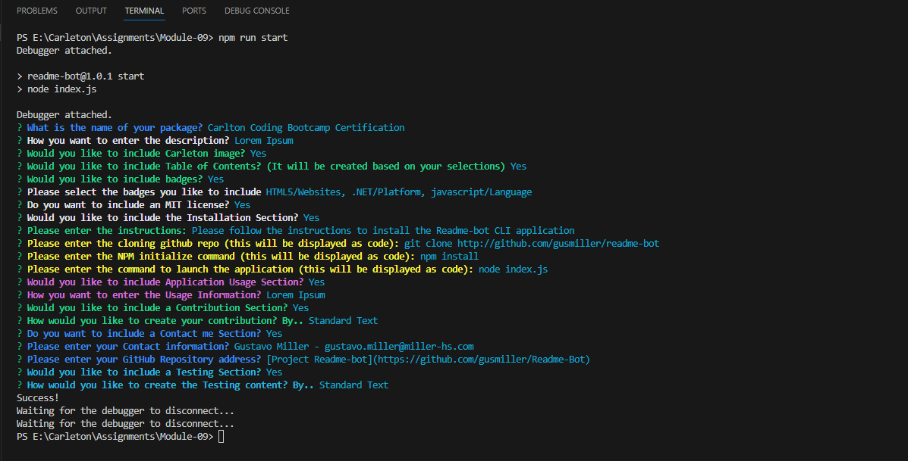

<a id="readme-top" name="readme-top"></a>

<p align="center"></p>

<p align="center" style="margin-top:25px; margin-bottom:50px;">
	<a></a>
	<a></a>
	<a></a>
	<a></a>
	<a></a>
	<a></a>
	<a></a>
</p>

# Carlton Coding Bootcamp Certification

<details style="margin-bottom: 25px; margin-top: 25px;">
	<summary>Table of Contents</summary>
	<ol>
		<li><a href="#Description">Project Description</a></li>
		<li><a href="#installation">Installation</a></li>
		<li><a href="#license">License</a></li>
		<li><a href="#usage">Application Usage</a></li>
		<li><a href="#contribution">Contributions</a></li>
		<li><a href="#contactme">Questions? Contact Me!</a></li>
		<li><a href="#testing">Testing Application</a></li>
	</ol>
</details>
<div id="Description" style="margin-top: 25px;">

## Readme-Bot Generator

We introuce ourselves, when we get a new job, or at school, at the soccer team. We all do, and we do it in an elloquent way -most of the times, because we are proud of who we are and what we have achieved in life and our experience. We want all to know who we are, what we know, and what we bring to the group. It is a normal and regular thing to do. Well, think of a Readme file as a way of introducing you application, what was the idea behind, how it does it and how can all use it.

In other words a Readme file should be described as a documentation with guidelines, instructions and parameters on how to use our project. It should contain different sections, each with instructions, steps, command and imagea on how to install and run the project.

In other words, a Readme.md file is an escential as part of any project. 

As developer's we need to know how to write a README because:

    - It is the first file a person will see when they encounter your project, so it should be fairly brief but detailed.
    - It will make your project standout from a bunch of others. Also be sure your project is good too.
    - It will help you focus on what your project needs to deliver and how.

Here is my product!

<div style="margin-top: 15px;">
	
</div>
</div>

<p align="right">(<a href="#readme-top">back to top</a>)</p>

<div id="installation" style="margin-bottom: 20px;margin-top: 20px;">

## Installation

Please follow the instructions to install the Readme-bot CLI application

1. Clone the Readme-bot repository
	```js
	git clone http://github.com/gusmiller/readme-bot
	```
2. Install NPM Packaged
	```js
	npm install
	```
3. Run CLI application
	```js
	node index.js
	```
</div>

<p align="right">(<a href="#readme-top">back to top</a>)</p>

<div id="license" style="margin-top: 25px;">

## License

MIT License

Copyright (c) 2023 Readme-Bot

Permission is hereby granted, free of charge, to any person obtaining a copy of this software and associated documentation files (the "Software"), to deal in the Software without restriction, including without limitation the rights to use, copy, modify, merge, publish, distribute, sublicense, and/or sell copies of the Software, and to permit persons to whom the Software is furnished to do so, subject to the following conditions:

The above copyright notice and this permission notice shall be included in all copies or substantial portions of the Software.

THE SOFTWARE IS PROVIDED "AS IS", WITHOUT WARRANTY OF ANY KIND, EXPRESS OR IMPLIED, INCLUDING BUT NOT LIMITED TO THE WARRANTIES OF MERCHANTABILITY, FITNESS FOR A PARTICULAR PURPOSE AND NONINFRINGEMENT. IN NO EVENT SHALL THE AUTHORS OR COPYRIGHT HOLDERS BE LIABLE FOR ANY CLAIM, DAMAGES OR OTHER LIABILITY, WHETHER IN AN ACTION OF CONTRACT, TORT OR OTHERWISE, ARISING FROM, OUT OF OR IN CONNECTION WITH THE SOFTWARE OR THE USE OR OTHER DEALINGS IN THE SOFTWARE.

<a></a>

<p align="right">(<a href="#readme-top">back to top</a>)</p>

</div>

<div id="usage" style="margin-top: 25px;">

## Application Usage

Application usage entered automatically by Lorem Ipsum. Lorem ipsum dolor, sit amet consectetur adipisicing elit. Doloribus natus iure dolorum aperiam itaque? Ipsam ad quidem quo neque aliquam natus blanditiis totam. Rerum accusantium fugit, alias numquam tenetur nemo necessitatibus laudantium officiis. Reprehenderit dolor labore iusto ut minus fugiat tempora, expedita corrupti. Ab tenetur similique ipsa dolore odio earum aliquam animi ducimus optio quibusdam ipsam eos ipsum perferendis, perspiciatis quasi temporibus. Aliquam perspiciatis dolorum est expedita quo possimus, quas temporibus pariatur mollitia debitis. Ducimus sapiente impedit culpa eos alias voluptas minima corporis veniam commodi perspiciatis. At quaerat quas porro veritatis sapiente nihil fugit cumque voluptatum voluptatem recusandae alias nulla iusto, quam exercitationem, ipsa corrupti possimus eligendi repellendus!

<p align="right">(<a href="#readme-top">back to top</a>)</p>

</div>

<div id="contribution" style="margin-top: 25px;">

## Contributing 

Contributions to this application are welcome! Being part of an open source community is what makes software so amazingly fun. Your contributions will be considered and **much appreciated**.

We are open to any suggestions that would make this application better and more stable. You know the process: fork the contents of my repo and create a pull request when you are done!

Don't forget to give the project a star!

	1.Fork the Project
	2.Create your working feature.
	3.Do your developing (don't forget to commit often!)
	4.Push your branch and create a Pull request.
	5.Thank you! we will review your chnges.

<p align="right">(<a href="#readme-top">back to top</a>)</p>

</div>

<div id="contactme" style="margin-top: 25px;">

## Questions? Contact Me 

The purpose of this Readme-bot is to help developers create their project Readme.md file that is required for ALL projects. Over time this application can save the developer lots of time, as this is a tedious process. The Readme-bot can be enhanced and there is growth for much more.

Do not hesitate in contacting me, Gustavo Miller - gustavo.miller@miller-hs.com.

You may find the application at: [https://github.com/gusmiller/Readme-Bot](https://github.com/gusmiller/Readme-Bot)

The current application contains the following questions:

- What is the name of your package?
- How you want to enter the description?
- Would you like to include Carleton image?
- Would you like to include Table of Contents?
- Would you like to include badges?
- Please select the badges you like to include HTML5/Websites, .NET/Platform, javascript/Language, jQuery/Language
- Do you want to include an MIT license?
- Would you like to include the Installation Section?
- Please enter the instructions: **Please follow the instructions to install the Readme-bot CLI application**
- Please enter the cloning github repo (this will be displayed as code): **git clone {repository}**
- Please enter the NPM initialize command (this will be displayed as code): **npm install**
- Please enter the command to launch the application (this will be displayed as code): **node index.js**
- Would you like to include Application Usage Section?
- How you want to enter the Usage Information? - **Lorem Ipsum or Free-Typing**
- Would you like to include a Contribution Section?
- How would you like to create your contribution? By.. **Lorem Ipsum, Standard Text or Free-Typing**
- Do you want to include a Contact me and Questions Section?
- Please enter your Contact information?
- Please enter your GitHub Repository address?
- Would you like to include a Testing Section?
- How would you like to create the Testing content? By.. **Lorem Ipsum, Standard Text or Free-Typing**


<p align="right">(<a href="#readme-top">back to top</a>)</p>

</div>

<div id="testing" style="margin-top: 25px;">

## Testing Application 

Testing the Readme-bot application is very important. We want to make sure we have all the sections tested and that our Readme file is being created correctly. You can enter the following sections in the readme-bot application:

	1.Provide the Application Name
	2.Application Description.
	3.Provide Badges (optional)
	4.Application License (optional).
	5.Installation Process (optional).
	6.Application Usage (optional).
	7.Contributions Section (optional).
	8.Contact section (optional).
	9.Testing Application (optional).

<p align="right">(<a href="#readme-top">back to top</a>)</p>

</div>

---
© 2023 edX Boot Camps LLC. Confidential and Proprietary. All Rights Reserved. Developed by Gustavo Miller.