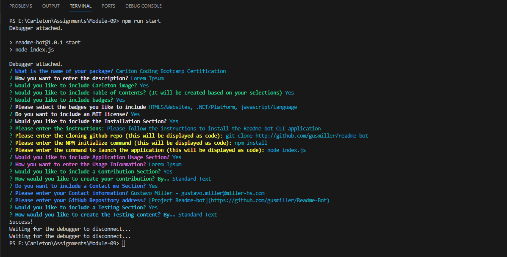

<a id="readme-top" name="readme-top"></a>

<p align="center"></p>


# Carlton Coding Bootcamp Certification

<details style="margin-bottom: 25px; margin-top: 25px;">
	<summary>Table of Contents</summary>
	<ol>
		<li><a href="#Description">Project Description</a></li>
		<li><a href="#installation">Installation</a></li>
		<li><a href="#license">License</a></li>
		<li><a href="#usage">Application Usage</a></li>
		<li><a href="#contribution">Contributions</a></li>
	</ol>
</details>
<div id="Description" style="margin-top: 25px;">

## Description

Description entered automatically by Lorem Ipsum. Aut, nobis quod earum, dolores accusamus modi libero possimus nam et aliquam non, blanditiis saepe. quod earum, dolores accusamus modi libero possimus nam et. Aut, nobis quod earum, dolores accusamus modi libero possimus nam et aliquam non, blanditiis saepe. quod earum, dolores accusamus modi libero possimus nam et.

Lorem ipsum dolor, sit amet consectetur adipisicing elit. Doloribus natus iure dolorum aperiam itaque? Ipsam ad quidem quo neque aliquam natus blanditiis totam. Rerum accusantium fugit, alias numquam tenetur nemo necessitatibus laudantium officiis. Reprehenderit dolor labore iusto ut minus fugiat tempora, expedita corrupti. Ab tenetur similique ipsa dolore odio earum aliquam animi ducimus optio quibusdam ipsam eos ipsum perferendis, perspiciatis quasi temporibus. Aliquam perspiciatis dolorum est expedita quo possimus, quas temporibus pariatur mollitia debitis. Ducimus sapiente impedit culpa eos alias voluptas minima corporis veniam commodi perspiciatis. At quaerat quas porro veritatis sapiente nihil fugit cumque voluptatum voluptatem recusandae alias nulla iusto, quam exercitationem, ipsa corrupti possimus eligendi repellendus!

Here is my product!

<div style="margin-top: 15px;">
	
</div>
</div>

<p align="right">(<a href="#readme-top">back to top</a>)</p>

<div id="installation" style="margin-bottom: 20px;margin-top: 20px;">

## Installation

Please follow the instructions to install the Readme-bot CLI application

1. Clone the Readme-bot repository
	```js
	git clone http://github.com/gusmiller/readme-bot
	```
2. Install NPM Packaged
	```js
	npm install
	```
3. Run CLI application
	```js
	node index.js
	```
</div>

<p align="right">(<a href="#readme-top">back to top</a>)</p>

<div id="license" style="margin-top: 25px;">

## License

MIT License

Copyright (c) 2023 Readme-Bot

Permission is hereby granted, free of charge, to any person obtaining a copy of this software and associated documentation files (the "Software"), to deal in the Software without restriction, including without limitation the rights to use, copy, modify, merge, publish, distribute, sublicense, and/or sell copies of the Software, and to permit persons to whom the Software is furnished to do so, subject to the following conditions:

The above copyright notice and this permission notice shall be included in all copies or substantial portions of the Software.

THE SOFTWARE IS PROVIDED "AS IS", WITHOUT WARRANTY OF ANY KIND, EXPRESS OR IMPLIED, INCLUDING BUT NOT LIMITED TO THE WARRANTIES OF MERCHANTABILITY, FITNESS FOR A PARTICULAR PURPOSE AND NONINFRINGEMENT. IN NO EVENT SHALL THE AUTHORS OR COPYRIGHT HOLDERS BE LIABLE FOR ANY CLAIM, DAMAGES OR OTHER LIABILITY, WHETHER IN AN ACTION OF CONTRACT, TORT OR OTHERWISE, ARISING FROM, OUT OF OR IN CONNECTION WITH THE SOFTWARE OR THE USE OR OTHER DEALINGS IN THE SOFTWARE.

<p align="right">(<a href="#readme-top">back to top</a>)</p>

</div>

<div id="usage" style="margin-top: 25px;">

## Application Usage

Application usage entered automatically by Lorem Ipsum. Lorem ipsum dolor, sit amet consectetur adipisicing elit. Doloribus natus iure dolorum aperiam itaque? Ipsam ad quidem quo neque aliquam natus blanditiis totam. Rerum accusantium fugit, alias numquam tenetur nemo necessitatibus laudantium officiis. Reprehenderit dolor labore iusto ut minus fugiat tempora, expedita corrupti. Ab tenetur similique ipsa dolore odio earum aliquam animi ducimus optio quibusdam ipsam eos ipsum perferendis, perspiciatis quasi temporibus. Aliquam perspiciatis dolorum est expedita quo possimus, quas temporibus pariatur mollitia debitis. Ducimus sapiente impedit culpa eos alias voluptas minima corporis veniam commodi perspiciatis. At quaerat quas porro veritatis sapiente nihil fugit cumque voluptatum voluptatem recusandae alias nulla iusto, quam exercitationem, ipsa corrupti possimus eligendi repellendus!

<p align="right">(<a href="#readme-top">back to top</a>)</p>

</div>

<div id="contribution" style="margin-top: 25px;">

## Contributing 

Contributions to this application are welcome! Being part of an open source community is what makes software so amazingly fun. Your contributions will be considered and **much appreciated**.

We are open to any suggestions that would make this application better and more stable. You know the process: fork the contents of my repo and create a pull request when you are done!

Don't forget to give the project a star! Thanks again!

<p align="right">(<a href="#readme-top">back to top</a>)</p>

</div>

